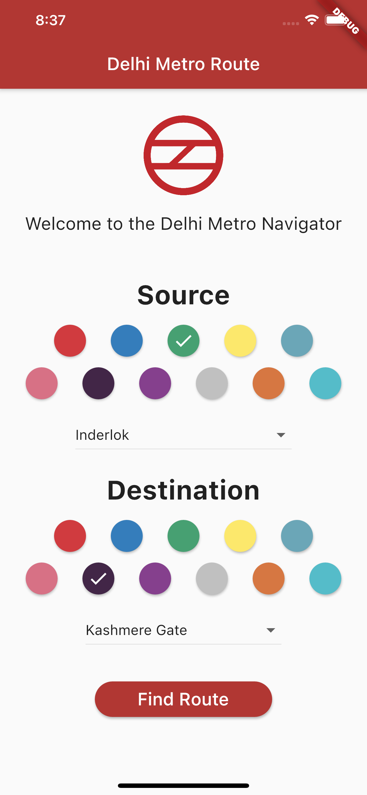
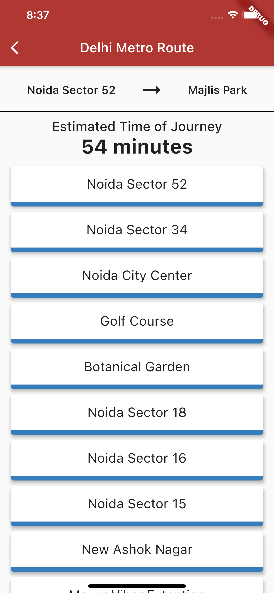

# Metro Route Application
  
This is the repository for a cross-platform app that allows the user to chart the shortest route from one metro station to another.   
*Supports all the metro stations as on 30th September 2020, including rapid metro and airport metro.*

## Screenshots

### Home Screen

### Route Screen

